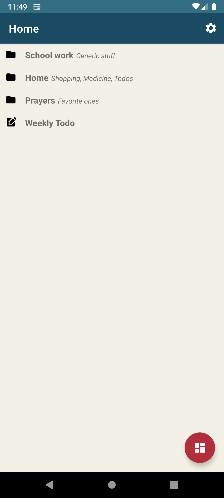
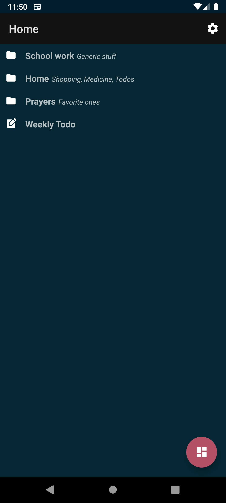
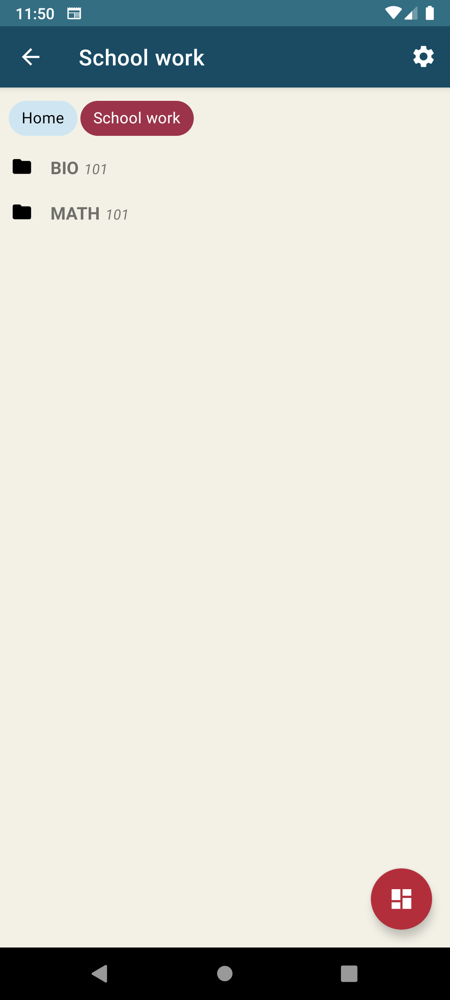
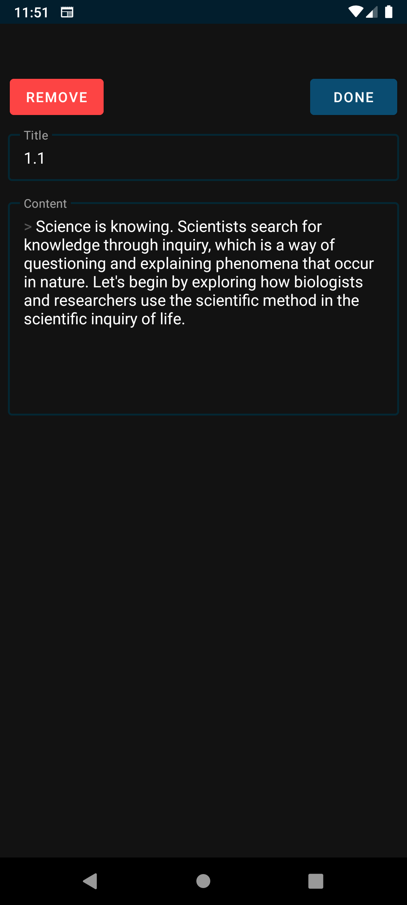
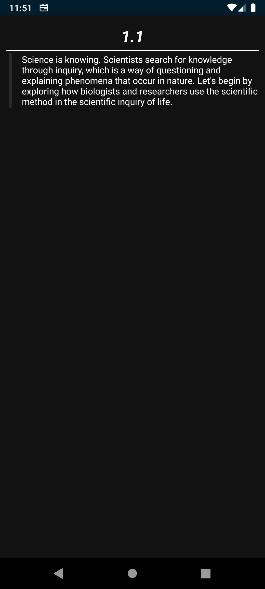

# Tiny Notes Manager

<p align="center">
  
</p>

<p align="center">
  A lightweight, hierarchical note-taking application for Android that helps you organize your thoughts, ideas, and information in a structured way.
</p>

<p align="center">
  <a href="https://github.com/Lmizuno/TinyNotesManager/actions/workflows/android-ci.yml">
    
  </a>
  <a href="https://github.com/Lmizuno/TinyNotesManager/releases">
    
  </a>
  <a href="LICENSE">
    
  </a>
</p>

## 📱 Features

- **Hierarchical Organization**: Create folders and subfolders to organize your notes in a tree-like structure
- **Rich Text Notes**: Write and format your notes with Markdown support
- **Dark Mode Support**: Choose between light, dark, or system default themes
- **Export & Import**: Share your notes or collections with others
- **Offline First**: All data is stored locally on your device
- **Breadcrumb Navigation**: Easily navigate through your folder hierarchy
- **Presentation Mode**: View your notes in a clean, distraction-free interface

## 📸 Screenshots

<p align="center">
  
  
  
  
  
</p>

## 🛠️ Technology Stack

### Frontend
- **Kotlin** - Primary programming language
- **Material Design 3** - Modern UI components and theming
- **ViewBinding** - Type-safe interaction with UI elements
- **Coroutines** - Asynchronous programming

### Backend & Data
- **Couchbase Lite** - NoSQL document database for local storage
- **Room Database** - (Deactivated) SQLite abstraction layer for structured data 
- **Gson** - JSON serialization/deserialization for data sharing

### Architecture
- **MVVM Pattern** - Clean separation of UI and business logic
- **Repository Pattern** - Centralized data management
- **LiveData** - Observable data holder for UI updates

### Testing
- **JUnit** - Unit testing framework
- **Mockk** - Mocking library for Kotlin
- **Robolectric** - Android unit testing framework

### CI/CD
- **GitHub Actions** - Automated testing and release workflows
- **Firebase Crashlytics** - Real-time crash reporting
- **Firebase Analytics** - Usage insights and performance monitoring

## 🏗️ Architecture

UI ◄─ ViewModel◄─ Repository ◄─ Database

Tiny Notes Manager follows the MVVM (Model-View-ViewModel) architecture pattern:

- **UI Layer**: Activities and Fragments that display data to the user
- **ViewModel Layer**: Manages UI-related data, handles user interactions
- **Repository Layer**: Single source of truth for data
- **Data Layer**: Local database (Couchbase Lite) and data models

## 🚀 Getting Started

### Prerequisites
- Android Studio Arctic Fox or newer
- JDK 21
- Android SDK 28+

### Building the Project
1. Clone the repository
   ```bash
   git clone https://github.com/Lmizuno/TinyNotesManager.git
   ```

2. Open the project in Android Studio

3. Sync Gradle files

4. Build and run the app
   ```bash
   ./gradlew assembleDebug
   ```

## 📊 Project Structure
app/\
├── src/\
│ ├── main/\
│ │ ├── java/com/lmizuno/smallnotesmanager/\
│ │ │ ├── dbManager/ # Database configuration\
│ │ │ ├── models/ # Data models \
│ │ │ ├── repositories/ # Data repositories\
│ │ │ ├── scripts/ # Utility scripts\
│ │ │ ├── utils/ # Helper classes\
│ │ │ └── viewmodels/ # ViewModels\
│ │ └── res/ # Resources (layouts, strings, etc.)\
│ └── test/ # Unit tests\
└── build.gradle.kts # App-level build configuration\

## 🔄 Continuous Integration

This project uses GitHub Actions for continuous integration and delivery:

- **CI Workflow**: Runs lint checks and unit tests on every push and pull request
- **CD Workflow**: Builds and publishes APKs for each release

## 📝 License

This project is licensed under the MIT License - see the [LICENSE](LICENSE) file for details.

## 📧 Contact

Lmizuno - [lmizunodevelopment@gmail.com](mailto:lmizunodevelopment@gmail.com)

Project Link: [https://github.com/Lmizuno/TinyNotesManager](https://github.com/Lmizuno/TinyNotesManager)